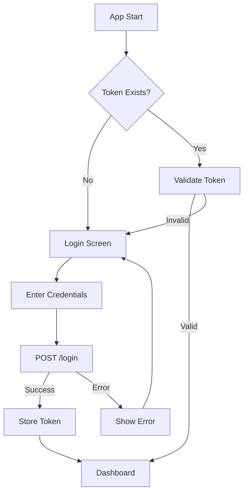
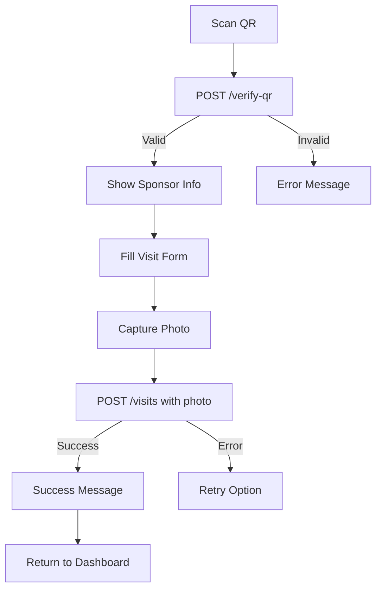
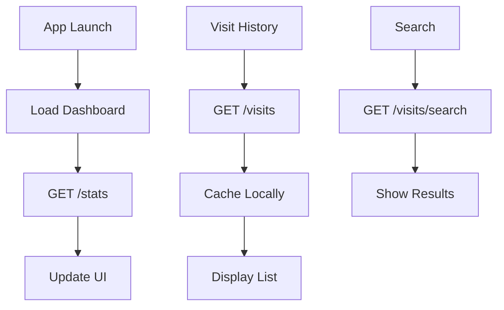

# Designer Mobile App - Flow Document

Complete user flow and technical implementation guide for the Visit Logger Designer mobile application.

## 📋 Table of Contents

1. [App Overview](#app-overview)
2. [User Flows](#user-flows)
3. [Screen-by-Screen Flow](#screen-by-screen-flow)
4. [API Integration Flow](#api-integration-flow)
5. [Technical Architecture](#technical-architecture)
6. [Error Handling](#error-handling)
7. [Offline Capabilities](#offline-capabilities)

---

## 🎯 App Overview

The Designer Mobile App is a Flutter-based application for interior designers to:
- Scan QR codes at sponsor locations
- Verify sponsor information
- Capture and submit visit photos with notes
- Track visit history and statistics
- Manage their profile and sessions

### Target Users
- Interior designers visiting sponsor showrooms
- Field representatives conducting site visits
- Sales personnel documenting client interactions

---

## 🔄 User Flows

### Primary User Flow
```
📱 App Launch
    ↓
🔐 Authentication Check
    ↓ (Not logged in)
📝 Login Screen → Enter credentials → API Login
    ↓ (Success)
🏠 Dashboard Screen
    ↓
📸 QR Scanner → Scan QR Code → Verify Sponsor
    ↓ (Valid sponsor)
📝 Visit Form → Enter notes → Capture photo
    ↓
📤 Submit Visit → API Upload → Success confirmation
    ↓
🏠 Return to Dashboard
```

### Secondary User Flows
```
📊 Statistics Flow:
Dashboard → Stats Tab → View analytics

📚 History Flow:
Dashboard → History Tab → Browse visits → Search/Filter

👤 Profile Flow:
Dashboard → Profile Tab → View/Edit profile → Logout
```

---

## 📱 Screen-by-Screen Flow

### 1. Splash Screen
**Purpose**: App initialization and authentication check
```
┌─────────────────────┐
│     VISIT LOGGER    │
│                     │
│        🏢          │
│                     │
│    Loading...       │
└─────────────────────┘
```

**Logic**:
- Check if user token exists in secure storage
- Validate token with API
- Route to Dashboard (if valid) or Login (if invalid)

**Duration**: 2-3 seconds maximum

---

### 2. Login Screen
**Purpose**: User authentication
```
┌─────────────────────┐
│   Welcome Back!     │
│                     │
│ Email: [________]   │
│ Password: [______]  │
│                     │
│   [LOGIN BUTTON]    │
│                     │
│   Forgot Password?  │
└─────────────────────┘
```

**Features**:
- Email/password input validation
- Show/hide password toggle
- Remember me option
- Loading state during login
- Error message display

**API Integration**:
```dart
POST /api/designer/login
Body: { "email": "user@example.com", "password": "password" }
Response: { "success": true, "data": { "user": {...}, "token": "..." } }
```

**Navigation**:
- Success → Dashboard
- Failure → Show error message

---

### 3. Dashboard Screen (Main Hub)
**Purpose**: Central navigation and quick actions
```
┌─────────────────────┐
│ Hi John! 👋         │
│                     │
│ ┌─────┐ ┌─────┐    │
│ │ 📸  │ │ 📊  │    │
│ │SCAN │ │STATS│    │
│ └─────┘ └─────┘    │
│                     │
│ Recent Visits:      │
│ • IKEA - 2 hrs ago │
│ • Home Depot - 1d  │
│                     │
│ [📚] [📊] [👤]     │
└─────────────────────┘
```

**Components**:
- Welcome message with user name
- Quick action buttons (Scan QR, View Stats)
- Recent visits list (last 5)
- Bottom navigation (History, Stats, Profile)

**API Integration**:
```dart
GET /api/designer/stats
Response: { "success": true, "data": { "stats": {...}, "recent_visits": [...] } }
```

---

### 4. QR Scanner Screen
**Purpose**: Scan sponsor QR codes
```
┌─────────────────────┐
│      [X] Close      │
│                     │
│ ┌─────────────────┐ │
│ │                 │ │
│ │  📷 CAMERA      │ │
│ │     VIEW        │ │
│ │                 │ │
│ │  [QR OVERLAY]   │ │
│ └─────────────────┘ │
│                     │
│ Point camera at     │
│ sponsor QR code     │
│                     │
│ [💡] Flash Toggle  │
└─────────────────────┘
```

**Features**:
- Real-time camera preview
- QR code detection overlay
- Flash toggle
- Auto-focus
- Success/error feedback

**QR Code Processing**:
```dart
Supported formats:
- "SPONSOR-123"
- "sponsor=123" 
- "123" (plain number)
- "http://domain.com/designer?sponsor=123"
```

**Flow**:
1. Camera initializes
2. QR code detected
3. Parse sponsor ID
4. Call verify-qr API
5. Navigate to sponsor details

---

### 5. Sponsor Verification Screen
**Purpose**: Display sponsor information and confirm visit
```
┌─────────────────────┐
│      ← Back         │
│                     │
│   SPONSOR FOUND ✅  │
│                     │
│ ┌─────────────────┐ │
│ │  IKEA Showroom  │ │
│ │  📍 Downtown    │ │
│ │  📞 555-0123    │ │
│ └─────────────────┘ │
│                     │
│ Modern furniture    │
│ and home solutions  │
│                     │
│ [CONFIRM VISIT] 🎯  │
└─────────────────────┘
```

**Data Displayed**:
- Sponsor name and company
- Location and contact
- Description
- Google Reviews link (optional)

**API Integration**:
```dart
POST /api/designer/verify-qr
Body: { "qr_data": "SPONSOR-123" }
Response: { "success": true, "data": { "sponsor": {...} } }
```

**Actions**:
- Confirm Visit → Navigate to Visit Form
- Back → Return to scanner

---

### 6. Visit Form Screen
**Purpose**: Capture visit details and photo
```
┌─────────────────────┐
│ ← Log Visit         │
│                     │
│ Sponsor: IKEA       │
│                     │
│ Visit Notes:        │
│ ┌─────────────────┐ │
│ │ Kitchen consult │ │
│ │ - Discussed... │  │
│ └─────────────────┘ │
│                     │
│ Photo: *Required    │
│ ┌─────────────────┐ │
│ │  📸 CAPTURE     │ │
│ │     PHOTO       │ │
│ └─────────────────┘ │
│                     │
│   [SUBMIT VISIT] 📤│
└─────────────────────┘
```

**Components**:
- Sponsor name display (read-only)
- Multi-line text input for notes
- Photo capture section
- Submit button (enabled when photo captured)

**Photo Capture Flow**:
1. Tap "Capture Photo"
2. Open camera interface
3. Take photo
4. Preview with retake option
5. Confirm and return to form

**Validation**:
- Notes: Required, 10-1000 characters
- Photo: Required, max 10MB, JPEG/PNG only

---

### 7. Camera Interface Screen
**Purpose**: Capture visit photos
```
┌─────────────────────┐
│  [X]           [⚡] │
│                     │
│ ┌─────────────────┐ │
│ │                 │ │
│ │   CAMERA VIEW   │ │
│ │                 │ │
│ │                 │ │
│ │                 │ │
│ └─────────────────┘ │
│                     │
│     [  📸  ]       │
│ [📱] Flip   [🖼️] Gallery│
└─────────────────────┘
```

**Features**:
- Full-screen camera preview
- Shutter button (large, accessible)
- Camera flip (front/rear)
- Gallery access (optional)
- Flash toggle
- Focus tap gesture

**Captured Photo Flow**:
```
Take Photo → Preview → [Retake | Use Photo] → Return to Visit Form
```

---

### 8. Photo Preview Screen
**Purpose**: Review and confirm captured photo
```
┌─────────────────────┐
│  ← Retake           │
│                     │
│ ┌─────────────────┐ │
│ │                 │ │
│ │  CAPTURED       │ │
│ │    PHOTO        │ │
│ │   PREVIEW       │ │
│ │                 │ │
│ └─────────────────┘ │
│                     │
│    [RETAKE] [USE]   │
└─────────────────────┘
```

**Actions**:
- Retake → Return to camera
- Use Photo → Return to visit form with photo

---

### 9. Visit History Screen
**Purpose**: Browse past visits
```
┌─────────────────────┐
│ Visit History 📚    │
│                     │
│ [Search: ______]    │
│                     │
│ ┌─────────────────┐ │
│ │ IKEA Showroom   │ │
│ │ Kitchen consult │ │
│ │ Sep 26, 2:30 PM │ │
│ └─────────────────┘ │
│ ┌─────────────────┐ │
│ │ Home Depot      │ │
│ │ Paint samples   │ │
│ │ Sep 25, 4:15 PM │ │
│ └─────────────────┘ │
│                     │
│ Load More...        │
└─────────────────────┘
```

**Features**:
- Search functionality
- Infinite scroll/pagination
- Pull-to-refresh
- Filter options (date, sponsor)

**List Item Display**:
- Sponsor name and company
- Visit notes (truncated)
- Date and time
- Thumbnail photo (optional)

**API Integration**:
```dart
GET /api/designer/visits?page=1&limit=20
GET /api/designer/visits/search?query=IKEA
```

---

### 10. Visit Detail Screen
**Purpose**: View complete visit information
```
┌─────────────────────┐
│  ← Visit Details    │
│                     │
│ IKEA Showroom       │
│ Sep 26, 2025 2:30PM │
│                     │
│ ┌─────────────────┐ │
│ │                 │ │
│ │  VISIT PHOTO    │ │
│ │                 │ │
│ └─────────────────┘ │
│                     │
│ Notes:              │
│ Kitchen consultation│
│ completed. Discussed│
│ cabinet options...  │
│                     │
│ [SHARE] [EXPORT]    │
└─────────────────────┘
```

**Features**:
- Full visit details
- Full-size photo view
- Share functionality
- Export options

---

### 11. Statistics Screen
**Purpose**: Display visit analytics
```
┌─────────────────────┐
│ Statistics 📊       │
│                     │
│ ┌─────┐ ┌─────┐    │
│ │ 12  │ │ 45  │    │
│ │TODAY│ │MONTH│    │
│ └─────┘ └─────┘    │
│ ┌─────┐ ┌─────┐    │
│ │ 156 │ │ 23  │    │
│ │TOTAL│ │SITES│    │
│ └─────┘ └─────┘    │
│                     │
│ Top Sponsors:       │
│ 1. IKEA (15 visits) │
│ 2. Home Depot (12)  │
│ 3. Lowe's (8)       │
└─────────────────────┘
```

**Metrics Displayed**:
- Visits today/week/month/total
- Unique sponsors visited
- Top sponsors by visit count
- Recent activity timeline

**API Integration**:
```dart
GET /api/designer/stats
Response: {
  "stats": {
    "visits_today": 3,
    "visits_this_week": 12,
    "visits_this_month": 45,
    "total_visits": 156,
    "unique_sponsors": 23
  }
}
```

---

### 12. Profile Screen
**Purpose**: User profile and settings
```
┌─────────────────────┐
│ Profile 👤          │
│                     │
│     [Avatar]        │
│   John Designer     │
│ john@example.com    │
│                     │
│ ┌─────────────────┐ │
│ │ Edit Profile    │ │
│ │ Settings        │ │
│ │ Help & Support  │ │
│ │ Privacy Policy  │ │
│ │ Terms of Use    │ │
│ └─────────────────┘ │
│                     │
│     [LOGOUT] 🚪     │
└─────────────────────┘
```

**Features**:
- User information display
- Settings access
- Help and support links
- Privacy/terms links
- Logout functionality

**Logout Flow**:
```
Tap Logout → Confirmation Dialog → [Cancel | Confirm] 
  → API Logout → Clear local data → Navigate to Login
```

---

## 🔄 API Integration Flow

### Authentication Flow


### Visit Submission Flow


### Data Synchronization


---

## 🏗️ Technical Architecture

### State Management (Provider Pattern)
```dart
// App State Structure
AppState
├── AuthState (user, token, isLoggedIn)
├── VisitState (currentVisit, history, isLoading)
├── CameraState (isInitialized, hasPermission)
├── NetworkState (isOnline, pendingUploads)
└── UIState (currentTab, isLoading, errors)
```

### Service Layer Architecture
```dart
Services/
├── ApiService (HTTP client, token management)
│   └── Base URL Configuration:
│       ├── Android Emulator: http://10.0.2.2:8000/api/designer
│       ├── iOS Simulator: http://YOUR_PC_IP:8000/api/designer
│       └── Physical Device: http://YOUR_PC_IP:8000/api/designer
├── CameraService (photo capture, permissions)
├── StorageService (secure storage, cache)
├── QRService (QR code parsing)
└── NetworkService (connectivity check)
```

### Local Storage Strategy
```dart
Storage Types:
├── Secure Storage (auth tokens, sensitive data)
├── Shared Preferences (settings, cache flags)
├── SQLite (offline visits, cached data)
└── File System (photos, logs)
```

---

## ⚠️ Error Handling

### Network Errors
```dart
Error Types:
├── No Internet Connection
│   └── Action: Show offline message, queue requests
├── Server Unreachable  
│   └── Action: Retry with exponential backoff
├── Authentication Failed
│   └── Action: Clear tokens, redirect to login
└── API Rate Limiting
    └── Action: Show friendly message, delay retry
```

### Camera Errors
```dart
Error Types:
├── Permission Denied
│   └── Action: Show permission request dialog
├── Camera Unavailable
│   └── Action: Fallback to gallery picker
├── Photo Capture Failed
│   └── Action: Allow retry, check storage space
└── Photo Too Large
    └── Action: Auto-compress or show size warning
```

### Validation Errors
```dart
Field Validations:
├── Email Format (login)
├── Password Length (login)  
├── Notes Length (visit form)
├── Photo Requirements (size, format)
└── QR Code Format (sponsor ID)
```

---

## 📱 Offline Capabilities

### Offline Features
```dart
Available Offline:
├── View cached visit history
├── Browse cached sponsor information  
├── Take photos (stored locally)
├── Fill visit forms (saved as drafts)
└── View basic statistics

Requires Online:
├── QR code verification
├── Visit submission
├── Login/logout
├── Real-time statistics
└── Search functionality
```

### Sync Strategy
```dart
Background Sync:
├── Auto-upload pending visits when online
├── Sync visit history when app opens
├── Download sponsor updates periodically
└── Upload photos with retry mechanism
```

### Data Caching
```dart
Cache Strategy:
├── Visit History: Cache last 100 visits
├── Sponsor Data: Cache verified sponsors
├── User Profile: Cache profile data
├── Statistics: Cache for 1 hour
└── Photos: Store locally, upload async
```

---

## 🎨 UI/UX Guidelines

### Design Principles
- **Material Design 3**: Follow latest Material Design guidelines
- **Accessibility**: Support screen readers, high contrast
- **Responsive**: Adapt to different screen sizes
- **Performance**: 60fps animations, quick load times

### Color Scheme
```dart
Primary Colors:
├── Primary: #1976D2 (Blue)
├── Secondary: #388E3C (Green)  
├── Error: #D32F2F (Red)
├── Warning: #F57C00 (Orange)
└── Success: #388E3C (Green)
```

### Typography
```dart
Text Styles:
├── Headlines: 24sp, Bold
├── Titles: 20sp, Medium
├── Body: 16sp, Regular  
├── Captions: 14sp, Regular
└── Labels: 12sp, Medium
```

### Component Standards
- **Buttons**: 48dp minimum touch target
- **Cards**: 8dp corner radius, elevation 2
- **Lists**: 72dp minimum item height
- **Images**: AspectRatio maintained, loading placeholders

---

## 🚀 Performance Optimization

### Image Handling
```dart
Photo Optimization:
├── Max resolution: 1920x1080
├── Compression: 85% quality JPEG
├── Size limit: 10MB
├── Format: JPEG preferred
└── Thumbnails: Generate for lists
```

### Memory Management
```dart
Memory Strategy:
├── Image caching with LRU eviction
├── Dispose camera controllers properly
├── Clear photo previews after use
├── Limit cached visit history
└── Use pagination for large lists
```

### Network Optimization
```dart
API Efficiency:
├── Request compression (gzip)
├── Response caching where appropriate
├── Batch requests when possible
├── Connection pooling
└── Timeout configuration (30s default)
```

---

## 🔒 Security Considerations

### Data Protection
```dart
Security Measures:
├── Token storage in secure keychain
├── API communication over HTTPS only
├── Photo metadata stripping
├── Input validation and sanitization
└── Certificate pinning (production)
```

### Privacy Features
```dart
Privacy Controls:
├── Camera permission requests
├── Location data handling (if added)
├── Photo deletion after upload
├── Cache clearing on logout
└── Data export functionality
```

---

## 📋 Testing Strategy

### Unit Tests
- API service methods
- QR code parsing logic
- Validation functions
- State management

### Integration Tests  
- Login flow end-to-end
- Visit submission flow
- Photo capture and upload
- Offline sync functionality

### Widget Tests
- Screen UI components
- Form validations
- Error state displays
- Loading indicators

---

## 🚀 Deployment Considerations

### Build Configurations
```dart
Environments:
├── Development (localhost API)
├── Staging (staging API)
└── Production (live API)

Build Variants:
├── Debug (development features)
├── Profile (performance testing)
└── Release (production optimized)
```

### App Store Requirements
```dart
Requirements:
├── Privacy policy compliance
├── Camera usage descriptions
├── Network usage justification
├── Data handling transparency
└── Accessibility compliance
```

---

This flow document provides a comprehensive guide for implementing the Designer Mobile App. Each screen and flow has been carefully designed to ensure a smooth user experience while maintaining technical excellence and scalability.